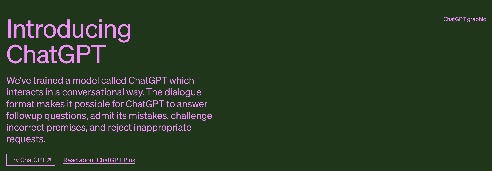
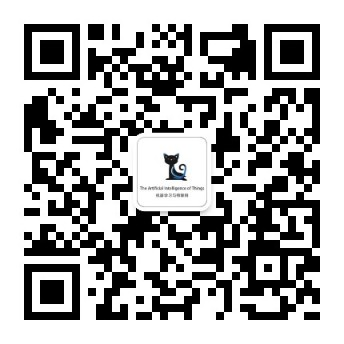

<h1>🧠 Awesome ChatGPT Chinese</h1>

ChatGPT工具和资料汇总学习，持续更新......  
为了帮助广大的中文开发者和学习者更好地理解和运用OpenAI的ChatGPT技术而创建的。我们会在这个仓库中持续更新有关ChatGPT的工具介绍，中文资料，包括但不限于工具使用教程、资料，论文、应用实例和ChatGPT社区等。

## 交流共享

诚邀您加入ChatGPT交流社群，与AI领域专家及来自不同行业的ChatGPT热衷者共同探讨、碰撞思想！无论您是行业专家还是技术爱好者，我们都热烈欢迎您的加入！

打造精品付费知识星球，已有众多伙伴加入。加入星球后，您将免费获得ChatGPT账户，并可免费进入「ChatGPT训练营VIP群」，共享最新资讯、技术实践及项目实施等经验。

<<<<<<< HEAD
| 二维码加群                                            | 公众号（回复"交流群"）                             |加入星球(更多优质内容)                                  |    
|--------------------------------------------------|---------------------------------------------------|---------------------------------------------------|
|  |  | |
=======

| 二维码加群                                        | 公众号（回复"交流群"）                                      | 加入星球(更多优质内容)                                  |                
|----------------------------------------------|---------------------------------------------------|---------------------------------------------------|
|  |  | |
>>>>>>> c840bc5fce345eaf9e39487fde26aa0bba62f709

[//]: # (| 二维码加群                                        | 机器学习与物联网公众号（回复"交流群"）                              | 拉你入群&#40;备注github&#41;                            )

[//]: # (|----------------------------------------------|---------------------------------------------------|---------------------------------------------------| )

[//]: # (|  |  |  |)

## ChatGPT全面工具箱：在任何地方使用 ChatGPT

### 浏览器扩充套件

- [ChatGPT for Google](https://chrome.google.com/webstore/detail/chatgpt-for-google/jgjaeacdkonaoafenlfkkkmbaopkbilf)：Chrome/Edge/Firefox 浏览器扩充套件，在 Google 搜索结果旁并列 ChatGPT 回应。（[Firefox扩充套件](https://addons.mozilla.org/en-US/firefox/addon/chatgpt-for-google/)、[程式码](https://github.com/wong2/chat-gpt-google-extension)）
- [ChatGPT Extension](https://chrome.google.com/webstore/detail/chatgpt-chrome-extension/cdjifpfganmhoojfclednjdnnpooaojb)：Chrome 浏览器扩充套件，在右上角弹窗快速使用 ChatGPT。（[程式码](https://github.com/kazuki-sf/ChatGPT_Extension)）
- [ChatGPT Everywhere](https://github.com/gragland/chatgpt-everywhere)：Chrome 浏览器扩充套件，在任何输入框使用 ChatGPT。（[demo](https://twitter.com/gabe_ragland/status/1599466486422470656)）

### 桌面应用程式

- [ChatGPT Desktop App](https://github.com/sonnylazuardi/chatgpt-desktop)：Windows/MacOS 桌面选单列应用程式。使用 Tauri 和 Rust 开发。
- [chatgpt-mac](https://github.com/vincelwt/chatgpt-mac)：MacOS 选单列应用程式。

### 编辑器

- [ChatGPT for VSCode](https://github.com/mpociot/chatgpt-vscode)：VSCode 扩充套件。（[demo](https://twitter.com/marcelpociot/status/1599180144551526400)）
- [intellij-chatgpt](https://github.com/LiLittleCat/intellij-chatgpt)：JetBrains 编辑器扩充套件。
- [chatgpt.vim](https://github.com/terror/chatgpt.nvim)：Neovim 插件，在 Neovim buffer 裡使用 ChatGPT。
- [docGPT](https://github.com/cesarhuret/docGPT)：Google 文件编辑器插件，在 Google Docs 内使用 ChatGPT。

### 启动器（Launcher）扩充套件

- [ChatGPT Raycast extension](https://github.com/abielzulio/chatgpt-raycast)：Raycast 扩充套件。

### 聊天机器人

- [Twitter/@ChatGPTBot](https://twitter.com/ChatGPTBot)：Twitter 推特机器人。（[程式码](https://github.com/transitive-bullshit/chatgpt-twitter-bot)）
- [ChatGPT ProBot](https://github.com/oceanlvr/ChatGPTBot)：GitHub APP。输入 `/chatgpt` 来与 ChatGPTBot 交谈。
- [chatgpt-telegram](https://github.com/m1guelpf/chatgpt-telegram)：执行自己的 GPTChat Telegram 机器人，只需要一行指令。
- [ChatGPT Telegram Bot in AWS Lambda](https://github.com/franalgaba/chatgpt-telegram-bot-serverless): ChatGPT Telegram 机器人，执行在 AWS Lambda 上。支援语音讯息和 Markdown 显示。
- [chatbot-telegram](https://github.com/Ciyou/chatbot-telegram): 一键运行 ChatGPT Telegram Bot，使用 `Deno` 和 `TypeScript` 打造。
- [chatGPT-discord-bot](https://github.com/Zero6992/chatGPT-discord-bot)：整合自己的 Discord 机器人。
- [wechat-chatgpt](https://github.com/fuergaosi233/wechat-chatgpt)：ChatGPT 的微信 Bot。装完依赖后只需要填写 OpenAI 帐号密码和微信扫码就可以使用。
- [ChatGPT LINE Bot](https://github.com/isdaviddong/chatGPTLineBot)（中文内容）：建立自己的 ChatGPT LINE 机器人。
- [gpt-ai-assistant](https://github.com/memochou1993/gpt-ai-assistant)（中文内容）：在 10 分钟内打造自己的 GPT LINE 机器人。
- [chatgpt-for-chatbot-feishu](https://github.com/go-zoox/chatgpt-for-chatbot-feishu)：快速将 ChatGPT 接入飞书的应用，基于 OpenAI 官方接口 GPT3 模型，支持私有部署，作为私人工作助理或者企业员工助理。

## 扩展 ChatGPT 功能

- [ShareGPT](https://sharegpt.com/): 轻分享 ChatGPT 对话纪录。（[demo](https://twitter.com/steventey/status/1599816553490366464)）
- [ChatGPT export to PNG/OpenAI-ChatGPT/HTML](https://github.com/liady/ChatGPT-pdf)：Chrome 浏览器扩充套件，能将 ChatGPT 纪录下载成 PNG、PDF 档，或产生可分享的连结。
- [ChatGPT Advanced](https://github.com/qunash/chatgpt-advanced): Chrome 浏览器扩充套件，在 ChatGPT 页面同时显示网页搜寻结果。
- [TampermonkeyUserscripts/ChatGPTVoiceInput](https://github.com/doggy8088/TampermonkeyUserscripts/blob/main/src/ChatGPTVoiceInput.user.js?fbclid=IwAR2sYE_CIOTdhNlRqaYwJ3eh-foa4O7ZHukYcc1dXLcU8IHLIDOt52gdAdQ)（中文内容）: Tampermonkey 脚本，ChatGPT 语音输入介面（支援中/英/日/韩语言）。

## 延伸应用

- [summarize.site](https://chrome.google.com/webstore/detail/summarize/lmhkmibdclhibdooglianggbnhcbcjeh)：Chrome 浏览器扩充套件，总结网页内容、给出摘要。
- [commitgpt](https://github.com/RomanHotsiy/commitgpt)：自动产生 commit 讯息。
- [chatgpt-action](https://github.com/kxxt/chatgpt-action): Github Action，让 ChatGPT review 你的 PR。
- [StackExplain](https://github.com/shobrook/stackexplain): 让 ChatGPT 解释错误讯息的命令列工具。
- [ChatMind](https://www.chatmind.tech/)：透过人工智慧对话生成心智图。

## 提示词（Prompts）

- [showGPT](https://showgpt.co/): 蒐集优质提示词的网站，你也可以轻鬆上传更多提示词。
- [awesome-chatgpt](https://github.com/saharmor/awesome-chatgpt): 各种 ChatGPT 提示词用法的文章和想法。
- [Awesome ChatGPT Prompts](https://github.com/f/awesome-chatgpt-prompts): ChatGPT 提示词清单。
- [ChatGPT 指令大全](https://www.explainthis.io/zh-hant/chatgpt)（中文内容）: 精炼过的指令语句，让你充分发挥 ChatGPT 的强大功能。

## 开发工具（API、SDK）

- [PyChatGPT](https://github.com/rawandahmad698/PyChatGPT)（Python）：轻量化、基于 TLS 的 ChatGPT API 可以在您的 CLI 中使用，无需使用浏览器或验证金钥。
- [pip/revChatGPT](https://github.com/acheong08/ChatGPT)（Python）：与 OpenAI 的 ChatGPT API 互动的轻量化套件。採用逆向工程手法。
- [npm/chatgpt](https://github.com/transitive-bullshit/chatgpt-api)（Node.js）：Node.js 客户端。
- [ChatGPT API Dart](https://github.com/MisterJimson/chatgpt_api_dart) (Dart): Dart 客户端。
- [go-chatgpt](https://github.com/abhayptp/go-chatgpt) (Golang): Golang 客户端。

## ChatGPT的镜像产品

以下对话式 AI 聊天机器人就像 ChatGPT，是最好的 ChatGPT 替代方案。

[Chatsonic](https://writesonic.com/chat)

[craft](https://www.craft.do/)：

[Vondy](https://www.vondy.com/)

[cursor](https://www.cursor.so/)（GPT4.0）

[Poe](https://poe.com/)（GPT4.0）

[Rytr](https://rytr.me/)

[FreeGPT](https://freegpt.one/)

[YouGPT](https://you.com/)

[Jasper](https://www.jasper.ai/)

## AI衍生产品

### AI绘画

[Jrnylist](https://www.jrnylist.com/)（关键词参考）：Jrnylist是一个基于关键词参考的工具，帮助您更高效地生成与特定关键词相关的文章和内容，为您的创作提供强大支持。

[Noonshot](https://prompt.noonshot.com/)（生成Midjourney关键词）：Noonshot是一款专注于生成Midjourney关键词的工具，能够根据您的需求生成有针对性的关键词，助力您在创作过程中找到灵感。

[Prompt Hunt](https://www.prompthunt.com/)（DALL·E和Midjourney绘画）：Prompt Hunt结合DALL·E和Midjourney技术，提供一款功能强大的绘画工具，让您能够轻松创作出令人惊艳的艺术作品。

[PromptBase](https://promptbase.com/)（DALL·E,Midjourney,ChatGPT,Stable Diffusion绘画）：利用了多种先进的人工智能技术，包括DALL·E、Midjourney、ChatGPT和Stable Diffusion绘画技术，使得PromptBase成为一个强大的内容生成与扩充平台。

[Hypotenuse AI](https://app.hypotenuse.ai/invited)（文字内容和绘画）：一款综合性的人工智能工具，专注于自动化文字内容和绘画生成。它利用了多种AI技术，包括自然语言处理、图像生成和深度学习，为用户提供一站式的创作解决方案。

### 论文

[Explainpaper](https://www.explainpaper.com/)（论文）：Explainpaper为您提供了论文解读服务，帮助您快速理解复杂的学术论文内容，提高阅读效率。

[LATERAL](https://www.lateral.io/)（整理归类论文）：LATERAL是一款整理和归类论文的工具，帮助您将众多论文进行有效管理，方便您快速找到所需的学术资料。

[SCISPACE](https://typeset.io/)（搜索论文）：SCISPACE是一款强大的论文搜索工具，助您快速查询相关领域的学术成果，满足您的研究需求。

️[arXiv Xplorer](https://arxivxplorer.com/)（（搜索论文）：arXiv Xplorer是一个针对arXiv平台的高效论文搜索引擎，让您在海量论文中轻松找到感兴趣的研究成果。

[PandaGPT](http://pandagpt.io/)（帮你阅读生成知识图谱）：PandaGPT能帮助您在阅读过程中自动生成知识图谱，提升您的学习效率和理解深度。

️[ChatPDF](https://www.chatpdf.com/)（快速提取PDF信息）: ChatPDF是一款专业的PDF信息提取工具，能够帮助您高效地获取PDF文档中的重要数据和内容，提高工作效率。

### 表格&数据库

[ChatExcel](https://chatexcel.com/convert)（表格）: ChatExcel是一个功能强大的表格处理工具，让您能够轻松地进行数据分析、整理和转换，助力您的数据处理工作。

[Excelformulabot](https://excelformulabot.com/)（Excel公式）：Excelformulabot提供了丰富的Excel公式资源，帮助您轻松解决复杂的数据计算问题，提升Excel技能。

[PromptDB](https://promptdb.ai/)（AI提示数据库）: PromptDB是一个基于AI技术的提示数据库，为您提供海量的智能提示和建议，助力您在各种场景下找到合适的解决方案。

### 问答

[ChatWP](https://wpdocs.chat/)（Wordpress问题方案）：ChatWP专注于解决Wordpress相关问题，提供实用的方案和指南，让您在搭建和管理Wordpress网站时得心应手。

️[Perplexity AI](https://www.perplexity.ai/)（AI搜索，它只能告诉你答案）：Perplexity AI是一款AI搜索工具，特点在于只提供直接的答案，让您在寻找解决方案时更加高效准确。

### 文本内容

[MagickPen](https://magickpen.com/)（文本内容）: MagickPen是一款强大的文本生成工具，利用先进的自然语言处理技术帮助用户快速生成高质量的文章、博客和其他文本内容，提高写作效率。

[OKaaaay](https://www.okaaaay.com/)（文本内容）: OKaaaay是一款智能文本编辑器，通过AI技术为用户提供实时的写作建议，改善文本质量，让写作变得更加轻松。

[Easy-Peasy.AI](http://easy-peasy.ai/)（文本内容）: Easy-Peasy.AI是一款便捷的AI写作助手，可以根据用户输入的关键词和需求，生成符合特定场景的文本内容，满足多样化的写作需求。

[TypeAI](https://type.ai/)（文本内容）: TypeAI是一款基于人工智能的在线文本生成工具，能够理解和模仿不同的写作风格，帮助用户创作出独特的文本内容，提高创意表现力。

[copymatic](https://copymatic.ai/)（文本内容）: Copymatic是一款专业的AI文案生成工具，通过分析用户提供的关键词，自动生成吸引人的广告文案、营销邮件等，助力提升市场推广效果。

[AI Screenwriter](https://aiscreenwriter.com/)（改善剧本）: AI Screenwriter是一款针对剧本创作的人工智能工具，可以分析现有剧本的结构和内容，为用户提供专业的改善建议，提升剧本质量和吸引力。

### 理解内容

[BiliGPT](https://b.jimmylv.cn/)（自动提取B站视频的中心思想或总结）: BiliGPT是一款针对B站视频的人工智能工具，可以快速提取视频的中心思想或总结，帮助用户更有效地理解视频内容。

[summarize.tech: AI](https://www.summarize.tech/)（自动获取YouTube视频的摘要或简介）：summarize.tech: AI是一款面向YouTube视频的智能摘要工具，能够自动获取视频的摘要或简介，让用户快速了解视频的关键信息。

[SolidPoint](https://www.solidpoint.ai/)（自动提取视频的中心思想或总结）: SolidPoint是一款强大的视频分析工具，可以自动提取视频的中心思想或总结，帮助用户更高效地获取视频的核心信息。

[Humata](https://www.humata.ai/)（提高阅读效率、总结价值内容）: Humata是一款专业的阅读效率提升工具，通过智能技术为用户提供精炼的内容总结，让用户在短时间内掌握文章的价值信息。

### 翻译

[风声雨声](https://fsys.app/): 风声雨声是一款专业的AI翻译工具，支持多种语言之间的实时翻译，为用户提供高质量、准确的翻译结果，帮助用户克服语言障碍，实现跨语言的沟通。

CLICK ME(点我查看全部)

 <text>敬请期待</text>

### 浏览器插件

[Detect GPT](https://www.thomas.io/detect-gpt)（实时检查内容真实性）: Detect GPT是一款实时检查内容真实性的AI工具，能够识别由人工智能生成的文本，帮助用户辨别信息的可靠性。

[Fluentify](https://www.fluentify.io/)（划字提问）: Fluentify是一款智能划词提问工具，可以帮助用户在阅读时快速提出问题，提高阅读理解能力。

[ArxivGPT](https://chrome.google.com/webstore/detail/arxivgpt/fbbfpcjhnnklhmncjickdipdlhoddjoh?hl=en)（总结论文并提供关键见解）: ArxivGPT是一款针对学术论文的AI工具，能够自动生成论文摘要并提供关键见解，帮助用户快速了解研究成果。

[ShareGPT](https://sharegpt.com/)（免费GPT）: ShareGPT是一款免费的GPT平台，提供多种基于AI的文本生成服务，为用户提供便捷的内容创作解决方案。

[HARPA AI](https://harpa.ai/)（网页自动化）: HARPA AI是一款网页自动化工具，利用人工智能技术实现网站内容管理、数据抓取和自动化任务处理，提高工作效率。

[Gmail AI](https://chatgptwriter.ai/)（谷歌邮箱生成邮件内容）: Gmail AI是一款基于AI的谷歌邮箱邮件内容生成工具，可以自动生成专业、高质量的电子邮件文本，提高邮件撰写效率。

### AI营销

[Ai Mailer](https://ai-mailer.com/)（生成邮件内容）: Ai Mailer是一款智能邮件内容生成工具，利用AI技术自动生成吸引人的电子邮件文本，提升邮件营销效果。

[HoppyCopy](https://www.hoppycopy.co/)（邮箱营销）: HoppyCopy是一款专业的邮箱营销工具，使用人工智能生成有针对性的邮件内容，帮助企业提高客户互动和转化率。

[Peppertype](https://www.peppertype.ai/)（营销内容）: Peppertype是一款基于AI的营销内容生成工具，可以帮助用户快速创作出高质量的广告文案、社交媒体内容和博客文章。

[MarketingBlocks](https://hey.marketingblocks.ai/)（营销内容）: MarketingBlocks是一款为营销人员量身打造的AI内容生成工具，提供高质量的营销文案、广告素材和策略建议。

[Yaara](https://yaara.ai/)（营销内容）：Yaara是一款智能营销内容生成工具，利用AI技术为用户提供个性化的营销策略和文案建议，提高市场推广效果。

[Shakespeare](https://www.shakespeare.ai/)（营销内容）: Shakespeare是一款基于AI的营销内容创作工具，可以为用户生成吸引人的文案、广告素材和社交媒体内容，提升品牌形象和市场竞争力。

[copyai](https://www.copy.ai/)（营销内容）: copyai是一款专业的AI营销文案生成工具，通过分析用户提供的关键词，快速生成吸引人的广告文案、营销邮件和社交媒体内容。

[SEO GPT](https://seovendor.co/)（网站SEO）: SEO GPT是一款面向网站优化的AI工具，提供关键词分析、网站内容优化和排名监控等功能，助力提升网站在搜索引擎中的排名。

[Yarnit](https://www.yarnit.app/)（PPT或海报）: Yarnit是一款基于AI的PPT和海报制作工具，能够根据用户的需求快速生成精美的演示文稿和宣传海报，提升视觉效果和传播力。

## GPT-4

【PDF资料】[OpenAI发布GPT-4,大模型的发展进入新的里程碑.pdf](OpenAI-GPT4/OpenAI发布GPT-4，大模型的发展进入新的里程碑.pdf)  
【PDF资料】[GPT-4-震撼发布,AI算法之巅.pdf](OpenAI-GPT4/GPT-4震撼发布-AI算法之巅.pdf)  
【PDF资料】[GPT-4-技术报告-中文.pdf](OpenAI-GPT4/GPT-4技术报告.pdf)  
【PDF资料】[GPT-4 Technical Report.pdf](OpenAI-GPT4/gpt-4.pdf)  
【OpenAI官网文章】[ChatGPT Blog](https://openai.com/blog/chatgpt/)  
【ChatGPTPro】[ChatGPTPro](https://chatgpt.pro/)  
【GPT-1论文】[Improving Language Understanding by Generative Pre-Training](https://cdn.openai.com/research-covers/language-unsupervised/language_understanding_paper.pdf)  
【GPT-2论文】[Language Models are Unsupervised Multitask Learners](https://cdn.openai.com/better-language-models/language_models_are_unsupervised_multitask_learners.pdf)  
【GPT-3论文】[Language Models are Few-Shot Learners](https://arxiv.org/abs/2005.14165)  
【InstructGPT论文】[Training language models to follow instructions with human feedback](https://arxiv.org/OpenAI-ChatGPT/2203.02155.pdf)  
【RHLF论文】[Augmenting Reinforcement Learning with Human Feedback](https://www.cs.utexas.edu/~ai-lab/pubs/ICML_IL11-knox.pdf)
【PPO算法论文】[Proximal Policy Optimization Algorithms](https://arxiv.org/abs/1707.06347)  
【Sparrow】[Improving alignment of dialogue agents via targeted human judgements](https://arxiv.org/abs/2209.14375)  
【LaMda】[LaMDA: Language Models for Dialog Applications](https://arxiv.org/abs/2201.08239)

## 百度-文心一言

【PDF资料】[华泰证券：文心一言：技术与能力拆解.pdf](百度-文心一心/华泰证券：文心一言：技术与能力拆解.pdf)  
【PDF资料】[华西证券：百度文心一言畅想.pdf](百度-文心一心/华西证券：百度文心一言畅想.pdf)  
【PDF资料】[开源证券：百度文心一言展望.pdf](百度-文心一心/开源证券：百度文心一言展望.pdf)  
【PDF资料】[首创证券：文心一言接入生态伙伴，AIGC关注度持续.pdf](百度-文心一心/首创证券：文心一言接入生态伙伴，AIGC关注度持续.pdf)  
【PDF资料】[ChatGPT系列—百度文心一言解读20230315.pdf](百度-文心一心/ChatGPT系列—百度文心一言解读20230315.pdf)  
【PDF资料】[文心一言测试指引.pdf](百度-文心一心/文心一言测试指引.pdf)

## 资料
【PDF资料】[哈尔滨工业大学-ChatGPT调研报告](OpenAI-ChatGPT/230311-哈尔滨工业大学-ChatGPT调研报告.pdf)
【PDF资料】[154页微软GPT研究报告（全中文版）](OpenAI-ChatGPT/154页微软GPT研究报告（全中文版）.pdf)
【PDF资料】[ChatGPT-真格基金分享.pdf](OpenAI-ChatGPT-真格基金分享.pdf)  
【PDF资料】[腾讯研究院AIGC发展趋势报告2023.pdf](OpenAI-ChatGPT/腾讯研究院AIGC发展趋势报告2023.pdf)  
【PDF资料】[从CHAT_GPT到生成式AI（Generative AI）：人工智能新范式，重新定义生产力.pdf](OpenAI-ChatGPT/从CHAT_GPT到生成式AI.pdf)  
【PDF资料】[ChatGPT - 开启AI新纪元.pdf](OpenAI-ChatGPT-开启AI新纪元.pdf)  
【PDF资料】[ChatGPT研究框架](https://mp.weixin.qq.com/s/YtJn2pfdS_on1nSATOylYw)  
【PDF资料】[ChatGPT研究框架2023.pdf](OpenAI-ChatGPT研究框架2023.pdf)  
【PDF资料】[AIGC行业深度报告-ChatGPT-重新定义搜索“入口”.pdf](OpenAI-ChatGPT/AIGC行业深度报告-ChatGPT-重新定义搜索“入口”.pdf)  
【PDF资料】[三分钟看懂ChatGPT.pdf](OpenAI-ChatGPT/三分钟看懂ChatGPT.pdf)  
【PDF资料】[从ChatGPT到通用智能新长征上的新变化.pdf](OpenAI-ChatGPT/从ChatGPT到通用智能新长征上的新变化.pdf)  
【PDF资料】[像ChatGPT这样的工具如何改变你的企业.pdf](OpenAI-ChatGPT/像ChatGPT这样的工具如何改变你的企业.pdf)  
【PDF资料】[揭秘ChatGPT身后的AIGC技术和它的中国同行们.pdf](OpenAI-ChatGPT/揭秘ChatGPT身后的AIGC技术和它的中国同行们.pdf)  
【PDF资料】[ChatGPT_Prompts_使用场景.pdf](OpenAI-ChatGPT/ChatGPT_Prompts_使用场景.pdf)  
【PDF资料】[ChatGPT过去现在与未来.pdf](OpenAI-ChatGPT/ChatGPT过去现在与未来.pdf)   

## Github-ChatGPT

【Github】[在微信上迅速接入 ChatGPT，让它成为你最好的助手！](https://github.com/fuergaosi233/wechat-chatgpt)  
【Github】[Reverse Engineered ChatGPT API by OpenAI. Extensible for chatbots etc.](https://github.com/acheong08/ChatGPT)  
【github】[This is a collection of prompt examples to be used with the ChatGPT model.](https://github.com/f/awesome-chatgpt-prompts)  
【Github】[ChatGPT Desktop Application (Mac, Windows and Linux)](https://github.com/lencx/ChatGPT)  
【Github】[ChatGPT 中文调教指南](https://github.com/PlexPt/awesome-chatgpt-prompts-zh)  
【Github】[Node.js client for the unofficial ChatGPT API.](https://github.com/transitive-bullshit/chatgpt-api)  
【Github】[几步即可获得一个基于 ChatGPT 的微信机器人](https://github.com/AutumnWhj/ChatGPT-wechat-bot)  
【Github】[ChatGPT for Google](https://github.com/wong2/chatgpt-google-extension)    
【Github】[Curated list of resources for ChatGPT and GPT-3 from OpenAI](https://github.com/humanloop/awesome-chatgpt)  
【Github】[OpenAI ChatGPT 的逆向工程SDK。直接使用网页最新ChatGPT。](https://github.com/PlexPt/chatgpt-java)  
【Github】[ChatGPT Android demonstrates OpenAI's ChatGPT on Android with Stream Chat SDK for Compose.](https://github.com/skydoves/chatgpt-android)  
【Github】[ChatGPT Extension for VSCode](https://github.com/mpociot/chatgpt-vscode)  
【Github】[ChatGPT Desktop App](https://github.com/sonnylazuardi/chatgpt-desktop)  
【Github】[PyChatGPT](https://github.com/rawandahmad698/PyChatGPT)  
【Github】[OpenAI Teams Bot app](https://github.com/formulahendry/openai-teams-bot)  
【Github】[ChatGPT资料汇总学习，持续更新](https://github.com/PlexPt/awesome-chatgpt-prompts-zh)

## 实践

【小白注册教程】[国内注册ChatGPT的保姆级教程-新手小白一看就会](https://mp.weixin.qq.com/s/3SeV5Wrj_cQJcd0yYYaeOQ)

【小白开通Plus教程】[手把手教你开通ChatGPT Plus！](https://mp.weixin.qq.com/s/r9GGdfk1Q3ukdHbEXBiY5A)  

【微信】[微信接入ChatGPT教程](https://mp.weixin.qq.com/s/NMtFMfXcIbqPwHUYIJIyPg)  

## 欢迎共建
【👬🏻】、欢迎👏🏻 Star ⭐️⭐️⭐️⭐️⭐️ && 提交 Pull requests 👏🏻👏🏻👏🏻  

## 推荐科学🪜
推荐这些VPN，稳定便宜，节点多，速度快，支持MacOS、Windows、安卓、IOS，配置方便

【🪜】Surfshark（https://surfshark.com/）

【🪜】ExpressVPN（https://www.expressvpn.com/）

[//]: # (【🪜】科技熊 &#40;https://kejibear.vip/auth/register?code=L8gB&#41;)

[//]: # ()
[//]: # (【🪜】一元机场（https://xn--4gq62f52gdss.com/#/register?code=7xnKddGH）)

## 交流共享
群满加我微信(备注github-ChatGPT)

 

创作不易，多少是一份心意，感谢老板随意赏~  

# ⚠️声明
以上资料来自网络整理，供大家学习参考，如有侵权，麻烦联系我删除！  

