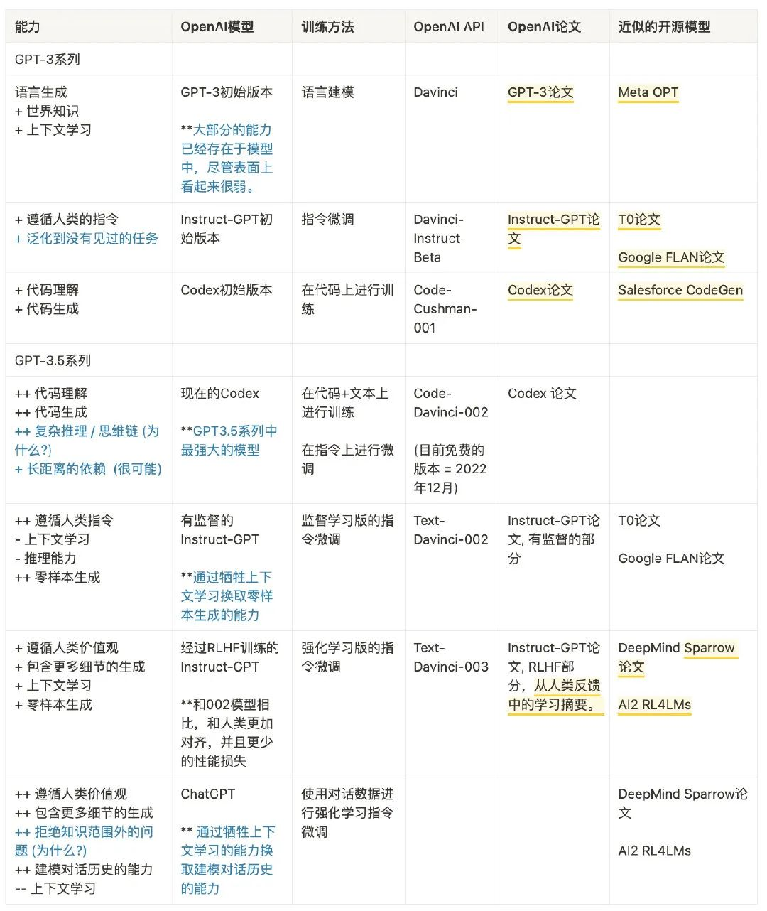
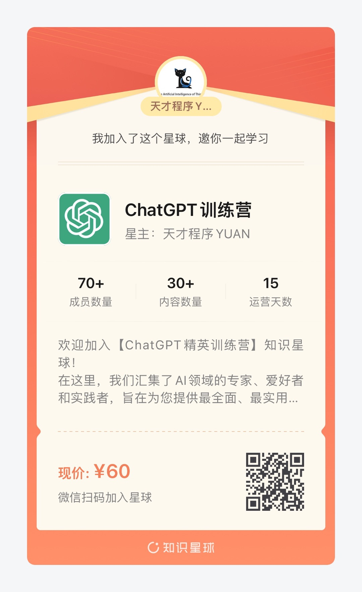

<h1>🧠 ChatGPT中文资料库</h1>

ChatGPT资料汇总学习，持续更新......  
为了帮助广大的中文开发者和学习者更好地理解和运用OpenAI的ChatGPT技术而创建的。我们会在这个仓库中持续更新有关ChatGPT的中文资料，包括但不限于教程、论文翻译、应用实例和问题解答等。

   

## 交流共享

【1】欢迎👏🏻👏🏻👏🏻加入ChatGP交流群，与AI领域专家和各行各业的ChatGPT爱好者一起交流碰撞💥💥💥！不管你是专业人士还是爱好者，都欢迎加入我们的群体！  
【2】创建付费知识星球，已有很多朋友加入，加入星球可免费领取ChatGPT账号并且免费加入「ChatGPT星球vip社群」、分享实时信息、技术实践、项目落地等。  

| 二维码加群                                        | 拉你入群(备注github)  | 加入星球(更多优质内容) | 星球限时优惠卷 | AI商业解析项目 |
|----------------------------------------------| ----  | ----  | ----  | ----  |
|  |  |  |  |  | 

<!--

## 交流共享
【1】ChatGPT技术交流群，群满加我微信拉你一起交流学习(备注github-ChatGPT)  
【2】注册ChatGPT账号麻烦的可以私信我取账号  
【3】更多有价值的内容在ChatGPT星球，可私信YUAN哥领取优惠券  

     

## 在任何地方使用 ChatGPT

### 浏览器扩充套件

- [ChatGPT for Google](https://chrome.google.com/webstore/detail/chatgpt-for-google/jgjaeacdkonaoafenlfkkkmbaopkbilf)：Chrome/Edge/Firefox 浏览器扩充套件，在 Google 搜索结果旁并列 ChatGPT 回应。（[Firefox扩充套件](https://addons.mozilla.org/en-US/firefox/addon/chatgpt-for-google/)、[程式码](https://github.com/wong2/chat-gpt-google-extension)）
- [ChatGPT Extension](https://chrome.google.com/webstore/detail/chatgpt-chrome-extension/cdjifpfganmhoojfclednjdnnpooaojb)：Chrome 浏览器扩充套件，在右上角弹窗快速使用 ChatGPT。（[程式码](https://github.com/kazuki-sf/ChatGPT_Extension)）
- [ChatGPT Everywhere](https://github.com/gragland/chatgpt-everywhere)：Chrome 浏览器扩充套件，在任何输入框使用 ChatGPT。（[demo](https://twitter.com/gabe_ragland/status/1599466486422470656)）

### 桌面应用程式

- [ChatGPT Desktop App](https://github.com/sonnylazuardi/chatgpt-desktop)：Windows/MacOS 桌面选单列应用程式。使用 Tauri 和 Rust 开发。
- [chatgpt-mac](https://github.com/vincelwt/chatgpt-mac)：MacOS 选单列应用程式。

### 编辑器

- [ChatGPT for VSCode](https://github.com/mpociot/chatgpt-vscode)：VSCode 扩充套件。（[demo](https://twitter.com/marcelpociot/status/1599180144551526400)）
- [intellij-chatgpt](https://github.com/LiLittleCat/intellij-chatgpt)：JetBrains 编辑器扩充套件。
- [chatgpt.vim](https://github.com/terror/chatgpt.nvim)：Neovim 插件，在 Neovim buffer 裡使用 ChatGPT。
- [docGPT](https://github.com/cesarhuret/docGPT)：Google 文件编辑器插件，在 Google Docs 内使用 ChatGPT。

### 启动器（Launcher）扩充套件

- [ChatGPT Raycast extension](https://github.com/abielzulio/chatgpt-raycast)：Raycast 扩充套件。

### 聊天机器人

- [Twitter/@ChatGPTBot](https://twitter.com/ChatGPTBot)：Twitter 推特机器人。（[程式码](https://github.com/transitive-bullshit/chatgpt-twitter-bot)）
- [ChatGPT ProBot](https://github.com/oceanlvr/ChatGPTBot)：GitHub APP。输入 `/chatgpt` 来与 ChatGPTBot 交谈。
- [chatgpt-telegram](https://github.com/m1guelpf/chatgpt-telegram)：执行自己的 GPTChat Telegram 机器人，只需要一行指令。
- [ChatGPT Telegram Bot in AWS Lambda](https://github.com/franalgaba/chatgpt-telegram-bot-serverless): ChatGPT Telegram 机器人，执行在 AWS Lambda 上。支援语音讯息和 Markdown 显示。
- [chatbot-telegram](https://github.com/Ciyou/chatbot-telegram): 一键运行 ChatGPT Telegram Bot，使用 `Deno` 和 `TypeScript` 打造。
- [chatGPT-discord-bot](https://github.com/Zero6992/chatGPT-discord-bot)：整合自己的 Discord 机器人。
- [wechat-chatgpt](https://github.com/fuergaosi233/wechat-chatgpt)：ChatGPT 的微信 Bot。装完依赖后只需要填写 OpenAI 帐号密码和微信扫码就可以使用。
- [ChatGPT LINE Bot](https://github.com/isdaviddong/chatGPTLineBot)（中文内容）：建立自己的 ChatGPT LINE 机器人。
- [gpt-ai-assistant](https://github.com/memochou1993/gpt-ai-assistant)（中文内容）：在 10 分钟内打造自己的 GPT LINE 机器人。
- [chatgpt-for-chatbot-feishu](https://github.com/go-zoox/chatgpt-for-chatbot-feishu)：快速将 ChatGPT 接入飞书的应用，基于 OpenAI 官方接口 GPT3 模型，支持私有部署，作为私人工作助理或者企业员工助理。

## 扩展 ChatGPT 功能

- [ShareGPT](https://sharegpt.com/): 轻分享 ChatGPT 对话纪录。（[demo](https://twitter.com/steventey/status/1599816553490366464)）
- [ChatGPT export to PNG/PDF/HTML](https://github.com/liady/ChatGPT-pdf)：Chrome 浏览器扩充套件，能将 ChatGPT 纪录下载成 PNG、PDF 档，或产生可分享的连结。
- [ChatGPT Advanced](https://github.com/qunash/chatgpt-advanced): Chrome 浏览器扩充套件，在 ChatGPT 页面同时显示网页搜寻结果。
- [TampermonkeyUserscripts/ChatGPTVoiceInput](https://github.com/doggy8088/TampermonkeyUserscripts/blob/main/src/ChatGPTVoiceInput.user.js?fbclid=IwAR2sYE_CIOTdhNlRqaYwJ3eh-foa4O7ZHukYcc1dXLcU8IHLIDOt52gdAdQ)（中文内容）: Tampermonkey 脚本，ChatGPT 语音输入介面（支援中/英/日/韩语言）。

## 延伸应用

- [summarize.site](https://chrome.google.com/webstore/detail/summarize/lmhkmibdclhibdooglianggbnhcbcjeh)：Chrome 浏览器扩充套件，总结网页内容、给出摘要。
- [commitgpt](https://github.com/RomanHotsiy/commitgpt)：自动产生 commit 讯息。
- [chatgpt-action](https://github.com/kxxt/chatgpt-action): Github Action，让 ChatGPT review 你的 PR。
- [StackExplain](https://github.com/shobrook/stackexplain): 让 ChatGPT 解释错误讯息的命令列工具。
- [ChatMind](https://www.chatmind.tech/)：透过人工智慧对话生成心智图。

## 提示词（Prompts）

- [showGPT](https://showgpt.co/): 蒐集优质提示词的网站，你也可以轻鬆上传更多提示词。
- [awesome-chatgpt](https://github.com/saharmor/awesome-chatgpt): 各种 ChatGPT 提示词用法的文章和想法。
- [Awesome ChatGPT Prompts](https://github.com/f/awesome-chatgpt-prompts): ChatGPT 提示词清单。
- [ChatGPT 指令大全](https://www.explainthis.io/zh-hant/chatgpt)（中文内容）: 精炼过的指令语句，让你充分发挥 ChatGPT 的强大功能。

## 开发工具（API、SDK）

- [PyChatGPT](https://github.com/rawandahmad698/PyChatGPT)（Python）：轻量化、基于 TLS 的 ChatGPT API 可以在您的 CLI 中使用，无需使用浏览器或验证金钥。
- [pip/revChatGPT](https://github.com/acheong08/ChatGPT)（Python）：与 OpenAI 的 ChatGPT API 互动的轻量化套件。採用逆向工程手法。
- [npm/chatgpt](https://github.com/transitive-bullshit/chatgpt-api)（Node.js）：Node.js 客户端。
- [ChatGPT API Dart](https://github.com/MisterJimson/chatgpt_api_dart) (Dart): Dart 客户端。
- [go-chatgpt](https://github.com/abhayptp/go-chatgpt) (Golang): Golang 客户端。

## 实验

- [gptlang](https://github.com/forrestchang/gptlang): 验证是否能利用 ChatGPT 建立一个程式语言的实验。

## 替代ChatGPT网站

[Chatsonic](https://writesonic.com/chat)

[craft](https://www.craft.do/)

[Vondy](https://www.vondy.com/)

[cursor](https://www.cursor.so/)（GPT4.0）

[Poe](https://poe.com/)（GPT4.0）

[Rytr](https://rytr.me/)

[FreeGPT](https://freegpt.one/)

[YouGPT](https://you.com/)

[Jasper](https://www.jasper.ai/)

## ChatGPT镜像网站

[BAI Chat](https://chat.theb.ai/)

[Chat For AI](https://chatforai.com/)

[Fast GPT](https://fastgpt.app/)

[Chat35](https://chat35.com/)

[FreeGPT](https://freegpt.one/)

## 大厂原版

[OpenAI ChatGPT](https://chat.openai.com/)

[New Bing](https://www.bing.com/new)

[Notion](https://www.notion.so/)

[百度文心一言](https://yige.baidu.com/)

## 进阶

[Hugging Face](https://huggingface.co/)

## 国内前沿AI

[写作猫](https://xiezuocat.com/)

## 网址导航

[FUTUREPEDIA](https://www.futurepedia.io/)

[Vondy](https://www.vondy.com/)

## 细分领域

### AI绘画

[Jrnylist](https://www.jrnylist.com/)（关键词参考）

[Noonshot](https://prompt.noonshot.com/)（生成Midjourney关键词）

[Prompt Hunt](https://www.prompthunt.com/)（DALL·E和Midjourney绘画）

[PromptBase](https://promptbase.com/)（DALL·E,Midjourney,ChatGPT,Stable Diffusion绘画）

[Hypotenuse AI](https://app.hypotenuse.ai/invited)（文字内容和绘画）

### 论文

[Explainpaper](https://www.explainpaper.com/)（论文）

[LATERAL](https://www.lateral.io/)（整理归类论文）

[SCISPACE](https://typeset.io/)（搜索论文）

️[arXiv Xplorer](https://arxivxplorer.com/)（搜索论文）

[PandaGPT](http://pandagpt.io/)（帮你阅读生成知识图谱）

️[ChatPDF](https://www.chatpdf.com/)（快速提取PDF信息）

### 表格&数据库

[ChatExcel](https://chatexcel.com/convert)（表格）

[Excelformulabot](https://excelformulabot.com/)（Excel公式）

[PromptDB](https://promptdb.ai/)（AI提示数据库）

### 问答

[ChatWP](https://wpdocs.chat/)（Wordpress问题方案）

️[Perplexity AI](https://www.perplexity.ai/)（AI搜索，它只能告诉你答案）

### 文本内容

[MagickPen](https://magickpen.com/)（文本内容）

[OKaaaay](https://www.okaaaay.com/)（文本内容）

[Easy-Peasy.AI](http://easy-peasy.ai/)（文本内容）

[TypeAI](https://type.ai/)（文本内容）

[copymatic](https://copymatic.ai/)（文本内容）

[AI Screenwriter](https://aiscreenwriter.com/)（改善剧本）

### 理解内容

[BiliGPT](https://b.jimmylv.cn/)（自动提取B站视频的中心思想或总结）

[summarize.tech: AI](https://www.summarize.tech/)（自动获取YouTube视频的摘要或简介）

[SolidPoint](https://www.solidpoint.ai/)（自动提取视频的中心思想或总结）

[Humata](https://www.humata.ai/)（提高阅读效率、总结价值内容）

### 翻译

[风声雨声](https://fsys.app/)

### 其他

[佛前AI](https://hotoke.ai/)（说出的苦恼）

[Mottle](https://mottle.com/)（构建自己的GPT）

[Rationale](https://rationale.jinaai.cn/)（分析最优解）

[Artifact](https://artifact.news/)（AI新闻推送）

### 🕸️ 浏览器插件

[Detect GPT](https://www.thomas.io/detect-gpt)（实时检查内容真实性）

[Fluentify](https://www.fluentify.io/)（划字提问）

[ArxivGPT](https://chrome.google.com/webstore/detail/arxivgpt/fbbfpcjhnnklhmncjickdipdlhoddjoh?hl=en)（总结论文并提供关键见解）

[ShareGPT](https://sharegpt.com/)（免费GPT）

[HARPA AI](https://harpa.ai/)（网页自动化）

[Gmail AI](https://chatgptwriter.ai/)（谷歌邮箱生成邮件内容）

### AI营销

[Ai Mailer](https://ai-mailer.com/)（生成邮件内容）

[HoppyCopy](https://www.hoppycopy.co/)（邮箱营销）

[Peppertype](https://www.peppertype.ai/)（营销内容）

[MarketingBlocks](https://hey.marketingblocks.ai/)（营销内容）

[Yaara](https://yaara.ai/)（营销内容）

[Shakespeare](https://www.shakespeare.ai/)（营销内容）

[copyai](https://www.copy.ai/)（营销内容）

[SEO GPT](https://seovendor.co/)（网站SEO）

[Yarnit](https://www.yarnit.app/)（PPT或海报）

## GPT-4
【GPT-4】[GPT-4震撼发布：多模态大模型，直接升级ChatGPT、必应，开放API，游戏终结了？](https://mp.weixin.qq.com/s/kA7FBZsT6SIvwIkRwFS-xw)  
【GPT-4】[GPT4震撼发布！哈佛教授：程序员职业3年内将被终结](https://mp.weixin.qq.com/s/c0KR3Jv_1Y3216N7SlOO3Q)  
【真格测试】[GPT3.5-GPT4-百度文心一言，差距还是蛮大的](https://docs.qq.com/sheet/DTEFsdkNERVVtR3BX)  
【PDF资料】[OpenAI发布GPT-4,大模型的发展进入新的里程碑.pdf](GPT4相关/OpenAI发布GPT-4，大模型的发展进入新的里程碑.pdf)  
【PDF资料】[GPT-4-震撼发布,AI算法之巅.pdf](GPT4相关/GPT-4震撼发布-AI算法之巅.pdf)  
【PDF资料】[GPT-4-技术报告-中文.pdf](GPT4相关/GPT-4技术报告.pdf)  
【PDF资料】[GPT-4 Technical Report.pdf](GPT4相关/gpt-4.pdf)  

## 百度-文心一言
【文心一言】[文心一言，期待与你相见](https://mp.weixin.qq.com/s/tUGwuNQi9UjSPVyeEGVEsQ)  
【PDF资料】[华泰证券：文心一言：技术与能力拆解.pdf](百度-文心/华泰证券：文心一言：技术与能力拆解.pdf)  
【PDF资料】[华西证券：百度文心一言畅想.pdf](百度-文心/华西证券：百度文心一言畅想.pdf)  
【PDF资料】[开源证券：百度文心一言展望.pdf](百度-文心/开源证券：百度文心一言展望.pdf)  
【PDF资料】[首创证券：文心一言接入生态伙伴，AIGC关注度持续.pdf](百度-文心/首创证券：文心一言接入生态伙伴，AIGC关注度持续.pdf)  
【PDF资料】[ChatGPT系列—百度文心一言解读20230315.pdf](百度-文心/ChatGPT系列—百度文心一言解读20230315.pdf)  
【PDF资料】[文心一言测试指引.pdf](百度-文心/文心一言测试指引.pdf)  

## 新闻时讯

【时讯】[Google发布Bard与ChatGPT竞争](https://hub.baai.ac.cn/view/23925)  
【时讯】[重磅，微软发布 ChatGPT 版搜索引擎，用上了比 ChatGPT 更强大的技术](https://www.36kr.com/p/2122399289378949)  
【时讯】[今天，微软重新发明搜索引擎：首款ChatGPT搜索来了](https://mp.weixin.qq.com/s/bZlpr4BhL4wpiE0TQovuxg)  
【时讯】[见证历史：ChatGPT版搜索引擎登场，12个新体验太震撼了](https://36kr.com/p/2123086022363273)  
【央视网】[实测“山寨”ChatGPT：费用挺高，答案离谱](https://mp.weixin.qq.com/s/3TF7Yb2uC1PW22K-aSZ3fw)  
【CCTV4】[ChatGPT狂飙！科技巨头纷纷布局](https://mp.weixin.qq.com/s/DGyOK2L-zOhODtWvf-wn-A)  
【机器之心】[微软ChatGPT版必应被黑掉了，全部Prompt泄露](https://mp.weixin.qq.com/s/89KeLjDoS9IyArIr8z6jjg)  
【复旦大学】[资讯｜复旦团队发布国内首个类ChatGPT模型MOSS，邀公众参与内测](https://fddi.fudan.edu.cn/5b/e2/c21257a482274/page.htm)  
【李开复】[李开复最新万字演讲：AI 2.0是绝对不能错过的一次革命](https://mp.weixin.qq.com/s/ddGbZd78BEd65L7599V3Cw)  
【微软】[昨夜，微软甩出Office王炸！又是AI神器，拯救打工人](https://mp.weixin.qq.com/s/DpBo4p9yhlRcERzcbyBQBg)  
【任正非】[任正非最新谈中美、科技、ChatGPT](https://mp.weixin.qq.com/s/7Njd3TYE8PNiKd2M37eGuw)  

## 论文

【OpenAI官方网站】[ChatGPT Blog](https://openai.com/blog/chatgpt/)  
【ChatGPTPro】[ChatGPTPro](https://chatgpt.pro/)  
【GPT-1论文】[Improving Language Understanding by Generative Pre-Training](https://cdn.openai.com/research-covers/language-unsupervised/language_understanding_paper.pdf)  
【GPT-2论文】[Language Models are Unsupervised Multitask Learners](https://cdn.openai.com/better-language-models/language_models_are_unsupervised_multitask_learners.pdf)  
【GPT-3论文】[Language Models are Few-Shot Learners](https://arxiv.org/abs/2005.14165)  
【InstructGPT论文】[Training language models to follow instructions with human feedback](https://arxiv.org/pdf/2203.02155.pdf)  
【RHLF论文】[Augmenting Reinforcement Learning with Human Feedback](https://www.cs.utexas.edu/~ai-lab/pubs/ICML_IL11-knox.pdf)  
【RHLF相关论文12篇】[RHLF论文集](PDF/RLHF论文集/)  
【PPO算法论文】[Proximal Policy Optimization Algorithms](https://arxiv.org/abs/1707.06347)  
【Sparrow】[Improving alignment of dialogue agents via targeted human judgements](https://arxiv.org/abs/2209.14375)  
【LaMda】[LaMDA: Language Models for Dialog Applications](https://arxiv.org/abs/2201.08239)

## 三方代码实现
【代码实现】 **ColossalAI** [hpcaitech/ColossalAI/ChatGPT](https://github.com/hpcaitech/ColossalAI/tree/main/applications/ChatGPT) , :+1: 如何使用可参考:[博客介绍](https://www.hpc-ai.tech/blog/colossal-ai-chatgpt)

CLICK ME(点我查看全部)

【代码实现】 **ColossalAI** [hpcaitech/ColossalAI/ChatGPT](https://github.com/hpcaitech/ColossalAI/tree/main/applications/ChatGPT) , :+1: 如何使用可参考:[博客介绍](https://www.hpc-ai.tech/blog/colossal-ai-chatgpt)

## 资料

【PDF资料】[ChatGPT-真格基金分享.pdf](PDF/ChatGPT-真格基金分享.pdf)  
【PDF资料】[腾讯研究院AIGC发展趋势报告2023.pdf](PDF/腾讯研究院AIGC发展趋势报告2023.pdf)  
【PDF资料】[从CHAT_GPT到生成式AI（Generative AI）：人工智能新范式，重新定义生产力.pdf](PDF/从CHAT_GPT到生成式AI.pdf)  
【PDF资料】[ChatGPT - 开启AI新纪元.pdf](PDF/ChatGPT-开启AI新纪元.pdf)  
【PDF资料】[ChatGPT研究框架](https://mp.weixin.qq.com/s/YtJn2pfdS_on1nSATOylYw)  
【PDF资料】[ChatGPT研究框架2023.pdf](PDF/ChatGPT研究框架2023.pdf)  
【PDF资料】[AIGC行业深度报告-ChatGPT-重新定义搜索“入口”.pdf](PDF/AIGC行业深度报告-ChatGPT-重新定义搜索“入口”.pdf)  
【PDF资料】[三分钟看懂ChatGPT.pdf](PDF/三分钟看懂ChatGPT.pdf)  
【PDF资料】[从ChatGPT到通用智能新长征上的新变化.pdf](PDF/从ChatGPT到通用智能新长征上的新变化.pdf)  
【PDF资料】[像ChatGPT这样的工具如何改变你的企业.pdf](PDF/像ChatGPT这样的工具如何改变你的企业.pdf)  
【PDF资料】[揭秘ChatGPT身后的AIGC技术和它的中国同行们.pdf](PDF/揭秘ChatGPT身后的AIGC技术和它的中国同行们.pdf)  
【PDF资料】[ChatGPT_Prompts_使用场景.pdf](PDF/ChatGPT/ChatGPT_Prompts_使用场景.pdf)  
【PDF资料】[ChatGPT过去现在与未来.pdf](PDF/ChatGPT/ChatGPT过去现在与未来.pdf)   

 

## 技术解读

【技术解读】[huggingface解读 Illustrating Reinforcement Learning from Human Feedback (RLHF) ](https://huggingface.co/blog/rlhf)  
【技术解读】[ChatGPT发展历程、原理、技术架构详解和产业未来 （收录于先进AI技术深度解读）](https://zhuanlan.zhihu.com/p/590655677)  
【技术解读】[ChatGPT内核：InstructGPT，基于反馈指令的PPO强化学习](https://zhuanlan.zhihu.com/p/589747432)  
【技术解读】[HuggingFace-解读 ChatGPT 背后的技术重点：RLHF、IFT、CoT、红蓝对抗](https://zhuanlan.zhihu.com/p/602458131)  
【技术解读】[从零实现ChatGPT——RLHF技术笔记](https://zhuanlan.zhihu.com/p/591474085)  
【技术解读】[张俊林-通向AGI之路：大型语言模型（LLM）技术精要](https://zhuanlan.zhihu.com/p/597586623)  
【技术解读】[ChatGPT/InstructGPT详解](https://zhuanlan.zhihu.com/p/590311003)  
【技术解读】[ 赛尔笔记 | 浅析ChatGPT的原理及应用 ](https://mp.weixin.qq.com/s/wLVoY6BwWd9p4DqrpOMOxg)  
【技术解读】[抱抱脸：ChatGPT背后的算法——RLHF | 附12篇RLHF必刷论文(论文在上面资料中)](https://zhuanlan.zhihu.com/p/592671478)  
【技术解读】[ChatGPT背后人工智能算法全部由国外公司发明](https://xueqiu.com/5760078642/241228577)  
【技术解读】[万字拆解！追溯ChatGPT各项能力的起源](https://mp.weixin.qq.com/s/VYv8BRgGnp9ZTuXxaSuFwg)  
【技术解读】[拆解追溯 GPT-3.5 各项能力的起源](https://yaofu.notion.site/GPT-3-5-360081d91ec245f29029d37b54573756)  
【技术解读】[ChatGPT出来后，我们是否真的面临范式转变?](https://mp.weixin.qq.com/s/60_h5biTOlBAa3Rt2tMn6A)  
【技术解读】[腾讯技术工程|万字长文教你如何做出 ChatGPT](https://mp.weixin.qq.com/s/8IFcQDhsLIWJIx8siF-wdQ)  
【腾讯】[关于ChatGPT的五个最重要问题](https://mp.weixin.qq.com/s/ACMAeGi0LPRWt2B8VrIojQ)

## 视频讲解
【李宏毅】[ChatGPT (可能)是怎麼煉成的 - GPT 社會化的過程](https://www.bilibili.com/video/BV1U84y167i3?p=1&vd_source=71b548de6de953e10b96b6547ada83f2)   
【陈縕侬】[深度學習之應用 | ADL 17.3: OpenAI ChatGPT 驚驗眾人的對話互動式AI](https://www.bilibili.com/video/BV1U84y167i3?p=3&vd_source=71b548de6de953e10b96b6547ada83f2)  
【李沐】[InstructGPT 论文精读【论文精读·48】](https://www.bilibili.com/video/BV1hd4y187CR/?spm_id_from=333.788&vd_source=71b548de6de953e10b96b6547ada83f2)

CLICK ME(点我查看全部)

【李宏毅】[ChatGPT (可能)是怎麼煉成的 - GPT 社會化的過程](https://www.bilibili.com/video/BV1U84y167i3?p=1&vd_source=71b548de6de953e10b96b6547ada83f2)   
【陈縕侬】[深度學習之應用 | ADL 17.3: OpenAI ChatGPT 驚驗眾人的對話互動式AI](https://www.bilibili.com/video/BV1U84y167i3?p=3&vd_source=71b548de6de953e10b96b6547ada83f2)  
【李沐】[InstructGPT 论文精读【论文精读·48】](https://www.bilibili.com/video/BV1hd4y187CR/?spm_id_from=333.788&vd_source=71b548de6de953e10b96b6547ada83f2)  
【油管】[chatgpt基本工作原理简单清晰介绍](https://www.youtube.com/watch?v=e0aKI2GGZNg&t=24s)  

## 中文ChatGPT
【复旦大学】[资讯｜复旦团队发布国内首个类ChatGPT模型MOSS，邀公众参与内测](https://fddi.fudan.edu.cn/5b/e2/c21257a482274/page.htm)  
【复旦Moss】[https://moss.fastnlp.top/](https://moss.fastnlp.top/)  
【复旦Moss Github】[https://github.com/txsun1997/MOSS](https://github.com/txsun1997/MOSS)  

CLICK ME(点我查看全部)

【期待】

## Github-ChatGPT

【Github】[在微信上迅速接入 ChatGPT，让它成为你最好的助手！](https://github.com/fuergaosi233/wechat-chatgpt)  
【Github】[Reverse Engineered ChatGPT API by OpenAI. Extensible for chatbots etc.](https://github.com/acheong08/ChatGPT)  
【github】[This is a collection of prompt examples to be used with the ChatGPT model.](https://github.com/f/awesome-chatgpt-prompts)  
【Github】[ChatGPT Desktop Application (Mac, Windows and Linux)](https://github.com/lencx/ChatGPT)  
【Github】[ChatGPT 中文调教指南](https://github.com/PlexPt/awesome-chatgpt-prompts-zh)  
【Github】[Node.js client for the unofficial ChatGPT API.](https://github.com/transitive-bullshit/chatgpt-api)  
【Github】[几步即可获得一个基于 ChatGPT 的微信机器人](https://github.com/AutumnWhj/ChatGPT-wechat-bot)  
【Github】[ChatGPT for Google](https://github.com/wong2/chatgpt-google-extension)    
【Github】[Curated list of resources for ChatGPT and GPT-3 from OpenAI](https://github.com/humanloop/awesome-chatgpt)  
【Github】[OpenAI ChatGPT 的逆向工程SDK。直接使用网页最新ChatGPT。](https://github.com/PlexPt/chatgpt-java)  
【Github】[ChatGPT Android demonstrates OpenAI's ChatGPT on Android with Stream Chat SDK for Compose.](https://github.com/skydoves/chatgpt-android)  
【Github】[ChatGPT Extension for VSCode](https://github.com/mpociot/chatgpt-vscode)  
【Github】[ChatGPT Desktop App](https://github.com/sonnylazuardi/chatgpt-desktop)  
【Github】[PyChatGPT](https://github.com/rawandahmad698/PyChatGPT)  
【Github】[OpenAI Teams Bot app](https://github.com/formulahendry/openai-teams-bot)  

## Github-ChatGPT-周边
【ChatRWKV】[ChatRWKV is like ChatGPT but powered by my RWKV language model](https://github.com/BlinkDL/ChatRWKV)  

CLICK ME(点我查看全部)

【ChatRWKV】[ChatRWKV is like ChatGPT but powered by my RWKV language model](https://github.com/BlinkDL/ChatRWKV)  

## Github-GPT系列
【GPT系列项目】[GPT2-Chinese](https://github.com/Morizeyao/GPT2-Chinese)  

CLICK ME(点我查看全部)

【GPT系列项目】[GPT2-Chinese](https://github.com/Morizeyao/GPT2-Chinese)  

## 实践
【实践】[量子位-ChatGPT能接入微信了！](https://zhuanlan.zhihu.com/p/590505058)  
【实践】[在国内，如何玩一下chatgpt？](https://www.zhihu.com/question/570939438)  
【小白注册教程】[ChatGPT 怎么用最新详细教程-新手小白一看就会](https://www.cnblogs.com/chat-gpt/p/how-to-use-chatgpt-in-china.html) 

CLICK ME(点我查看全部)

【实践】[量子位-ChatGPT能接入微信了！](https://zhuanlan.zhihu.com/p/590505058)  
【实践】[在国内，如何玩一下chatgpt？](https://www.zhihu.com/question/570939438)  
【小白注册教程】  
【飞书】[飞书接入ChatGPT教程](https://github.com/bestony/ChatGPT-Feishu)  

## 相关文章

【知乎问答】[ChatGPT 爆火，谷歌投资其竞品公司，谷歌创始人亲自下场改代码，这场 AI 风暴对巨头们有何冲击？](https://www.zhihu.com/question/582114806)  
【知乎问答】[ChatGPT 有哪些神奇的使用方式？](https://www.zhihu.com/question/570729170)  
【知乎问答】[Chat GPT有多高的技术壁垒？国内外除了OpenAI还有谁可以做到类似程度？ ?](https://www.zhihu.com/question/581806122)  
【知乎问答】[阻碍国内团队研究 ChatGPT 这样产品的障碍有哪些，技术，钱，还是领导力？](https://www.zhihu.com/question/570782945)  
【知乎问答】[以 ChatGPT 为代表的「大模型」会是多大的技术革命？如果要发生技术革命需要具备哪些条件？](https://www.zhihu.com/question/581311491)  
【知乎问答】[国内首个 ChatGPT 检测器发布，它是如何区别人类与 AI 的？我们还能做什么？](https://www.zhihu.com/question/578268304)  
【知乎问答】[OpenAI 的超级对话模型 ChatGPT 会导致程序员大规模失业吗？](https://www.zhihu.com/question/570403406)  
【知乎问答】[ChatGPT 离真正的商业化落地还有多远？](https://www.zhihu.com/question/578492084)  
【知乎问答】[ChatGPT 已经对码农造成了什么影响？](https://www.zhihu.com/question/579037511)  
【知乎问答】[ChatGPT的出现会不会导致底层程序员失业？](https://www.zhihu.com/question/570596331)  
【知乎问答】[国内有类似 ChatGPT 能力的模型吗？](https://www.zhihu.com/question/570713548)  
【知乎问答】[如何评价 ChatGPT ？会取代搜索引擎吗？](https://www.zhihu.com/question/570062224)  
【张俊林】[ChatGPT会取代搜索引擎吗](https://zhuanlan.zhihu.com/p/589533490)  
【新智元】[ChatGPT爆火，LeCun心态崩了！称大语言模型是邪路，Meta模型3天惨遭下线](https://mp.weixin.qq.com/s/Q9H-78VyI1tZ_9u1kvF_nA)  
【知乎问答】[如何评价 OpenAI 的超级对话模型 ChatGPT ？](https://www.zhihu.com/question/570189639)  
【知乎问答】[百度类似 ChatGPT 的项目名字确定为「文心一言」，三月份完成内测，哪些信息值得关注？](https://www.zhihu.com/question/582588618)  
【谷歌CEO】[An important next step on our AI journey](https://blog.google/technology/ai/bard-google-ai-search-updates/)  
【知乎问答】[OpenAI 的 ChatGPT 会怎样影响国内的 NLP 研究？](https://www.zhihu.com/question/571460238)  
【量子位】[ChatGPT偷家：Stack Overflow正被程序员抛弃，访问量一个月骤降3200W](https://zhuanlan.zhihu.com/p/602818608)  
【ChatGPT之父】[ 对话ChatGPT之父！AI会改变什么？不会改变什么](https://mp.weixin.qq.com/s/B5Aku-r4jQYVfO89jxu_Xg)  
【知乎问答】[ChatGPT 最容易取代的是哪些领域？](https://www.zhihu.com/question/582498339/answer/2918852536)  

## 欢迎共建
【👬🏻】、欢迎👏🏻 Star ⭐️⭐️⭐️⭐️⭐️ && 提交 Pull requests 👏🏻👏🏻👏🏻  

## 推荐科学🪜
推荐这些VPN，稳定便宜，节点多，速度快，支持MacOS、Windows、安卓、IOS，配置方便

【🪜】Surfshark（https://surfshark.com/）

【🪜】ExpressVPN（https://www.expressvpn.com/）

【🪜】科技熊 (https://kejibear.vip/auth/register?code=L8gB)

【🪜】一元机场（https://xn--4gq62f52gdss.com/#/register?code=7xnKddGH）

## 交流共享
群满加我微信(备注github-ChatGPT)

 

创作不易，多少是一份心意，感谢老板随意赏~  

   

## 关于我
YUAN哥，哈工大毕业，计算机博士在读，研究方向：人工智能，机器学习与物联网
v:

 

# ⚠️声明
以上资料来自网络整理，供大家学习参考，如有侵权，麻烦联系我删除！  
v: 

 

